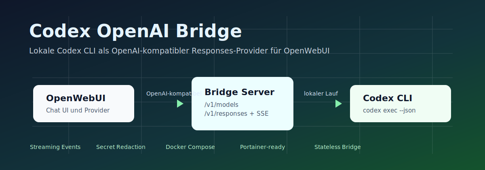
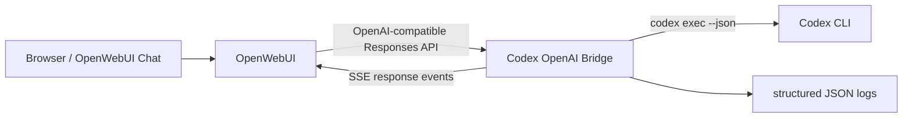

# Codex OpenAI Bridge



Ein schlanker OpenAI-kompatibler Bridge-Server, der die Codex CLI als lokalen OpenWebUI-Provider nutzbar macht.

[](https://github.com/adrianweidig/codex-openai-bridge/actions/workflows/ci.yml)
[](https://github.com/adrianweidig/codex-openai-bridge/actions/workflows/codeql.yml)
[](LICENSE)
[](https://github.com/adrianweidig/codex-openai-bridge/releases)
[](https://github.com/adrianweidig/codex-openai-bridge/issues)
[](https://github.com/adrianweidig/codex-openai-bridge/pulls)

**Quick Links:** [Schnellstart](#schnellstart) · [Konfiguration](#konfiguration) · [OpenWebUI](#openwebui-integration) · [Entwicklung](#entwicklung) · [Security](SECURITY.md) · [Contributing](CONTRIBUTING.md)

## Was ist das?

Codex OpenAI Bridge stellt lokale Codex-CLI-Läufe über eine kleine HTTP-Brücke bereit. OpenWebUI kann die Bridge als OpenAI-kompatiblen Anbieter mit `api_type=responses` registrieren und danach Codex-Modelle über `/v1/models` und `/v1/responses` ansprechen.

Der Chat-Completions-Endpunkt `/v1/chat/completions` bleibt als Fallback vorhanden. Für OpenWebUI ist `/v1/responses` der primäre Pfad.

Das Repository ist für lokale Docker-, Docker-Compose- und Portainer-Setups gedacht. Es enthält keine Secrets und speichert keine OpenAI- oder Codex-Schlüssel im Image.

## Für wen ist das gedacht?

- Nutzer, die Codex CLI lokal oder in einem Docker-Container über OpenWebUI testen möchten.
- Maintainer von privaten oder lokalen OpenWebUI-Stacks, die einen Responses-Provider ergänzen wollen.
- Entwickler, die eine kleine, nachvollziehbare Bridge ohne zusätzliche Framework-Schicht prüfen oder erweitern möchten.

## Grenzen

- Der Service führt `codex exec` aus und sollte nicht ungeschützt im öffentlichen Netz betrieben werden.
- Die Bridge ist stateless und implementiert keine serverseitige Verkettung über `previous_response_id`.
- OpenWebUI-Live-Ausgaben im Hauptchat benötigen eine normale Browser-JWT-Session. Eine reine API-Key-Session kann Antworten speichern, erhält aber keine `user:<id>`-Socket-Events.
- Das Projekt steht unter der [MIT-Lizenz](LICENSE).

## Features

- OpenAI-kompatible Endpunkte für `GET /v1/models` und `POST /v1/responses`
- Fallback für `POST /v1/chat/completions`
- Streaming über Responses-API-SSE-Events
- optionaler OpenWebUI-Kompatibilitätsmodus mit `chat.completion.chunk`-Deltas
- sichtbare, redigierte Codex-Fortschrittsmeldungen statt versteckter Modellgedanken
- optionale Bearer-Token-Prüfung über `CODEX_BRIDGE_API_KEY` oder Docker Secret
- interaktiver Installer für `.env`, Secret-Datei, Compose-Datei, Image-Build, Start und OpenWebUI-Provider-Registrierung
- Portainer-/Compose-Vorlage für bestehende OpenWebUI-Stacks
- kleine Python-Unittest-Suite für Payload-, Streaming- und Redaktionslogik

## Architektur



Weitere Details stehen in [docs/ARCHITECTURE.md](docs/ARCHITECTURE.md).

## Enthalten

| Pfad | Zweck |
| --- | --- |
| `src/codex_openai_bridge.py` | HTTP-Bridge mit Responses API, Streaming-Events und optionaler Bearer-Token-Prüfung |
| `Dockerfile` | Container mit Python, Node.js, Codex CLI, Playwright/Chromium und typischen Codex-Werkzeugen |
| `docker-compose.yml` | eigenständig startbarer Bridge-Service |
| `examples/openwebui_stack.override.yml` | Compose-Snippet für bestehende OpenWebUI-Portainer-Stacks |
| `install.sh` | interaktiver Installer für `.env`, Secret-Datei, Compose-Datei, Build, Start und Provider-Registrierung |
| `scripts/configure_openwebui_provider.py` | registriert die Bridge in OpenWebUI als `api_type=responses` |
| `docs/freund-installation.md` | kurze Weitergabe-Anleitung für andere Nutzer |
| `tests/` | Payload-, Schema-, Streaming- und Redaktions-Tests |

## Voraussetzungen

Für den Containerbetrieb:

- Docker mit `docker compose`
- Git
- eine laufende OpenWebUI-Instanz
- ein OpenWebUI-Admin-API-Key, falls der Provider automatisch registriert werden soll
- ein Codex/OpenAI-Konto für `codex login`

Für lokale Tests ohne Container:

- Python 3
- Bash für `bash -n install.sh`

Das Docker-Image basiert auf `node:24-bookworm-slim` und installiert unter anderem Python 3, Codex CLI, Playwright/Chromium, `git`, `ripgrep`, `fd`, `jq`, `curl`, `wget`, `bash` und Build-Werkzeuge.

## Schnellstart

Für eine neue Umgebung ist der interaktive Installer der empfohlene Weg:

```bash
bash install.sh
```

Der Installer fragt die wichtigsten Werte ab, erzeugt `.env`, `secrets/codex_bridge_api_key` und `docker-compose.generated.yml`, prüft Compose, baut das Image auf Wunsch, startet den Container optional und kann den Provider direkt in OpenWebUI registrieren.

Wenn Codex im Container noch nicht authentifiziert ist:

```bash
docker compose --env-file .env -f docker-compose.generated.yml run --rm --entrypoint codex codex-openai-bridge login
docker compose --env-file .env -f docker-compose.generated.yml restart codex-openai-bridge
```

Status und Healthcheck:

```bash
docker compose --env-file .env -f docker-compose.generated.yml ps
curl http://localhost:4010/health
```

Modelle prüfen:

```bash
source .env
curl -H "Authorization: Bearer $CODEX_BRIDGE_API_KEY" http://localhost:4010/v1/models
```

Ohne den Authorization-Header antwortet `/v1/models` absichtlich mit `401 Unauthorized`, wenn ein Bridge-Key gesetzt ist. `/health` bleibt für einfache Browser-Checks ohne Auth erreichbar.

## Manuelle Installation

Statt des Installers kann `.env.example` als Vorlage genutzt werden:

```bash
mkdir -p secrets
printf '%s\n' "$CODEX_BRIDGE_API_KEY" > secrets/codex_bridge_api_key
docker compose up -d --build
```

Der Standard-Compose-Stack hängt den Arbeitsbereich unter `./workspace:/workspace` ein und nutzt ein persistentes Docker-Volume für `/home/codex/.codex`.

## OpenWebUI-Integration

Wenn der Bridge-Container im selben Docker-Netz wie OpenWebUI läuft, ist die interne Provider-URL:

```text
http://codex-openai-bridge:4010/v1
```

In OpenWebUI muss der Anbieter als OpenAI-kompatibler Provider mit `api_type=responses` registriert werden. Das kann per Skript erfolgen:

```bash
export OPENWEBUI_ADMIN_TOKEN="sk-..."
export CODEX_BRIDGE_API_KEY="dein-lokaler-bridge-token"
python scripts/configure_openwebui_provider.py \
  --openwebui-url http://localhost:3000 \
  --bridge-url http://codex-openai-bridge:4010/v1
```

Für bestehende OpenWebUI-Compose-Dateien kann [examples/openwebui_stack.override.yml](examples/openwebui_stack.override.yml) als Vorlage genutzt werden. Wichtig ist, dass der Service im gleichen Docker-Netz wie `open-webui` hängt.

In OpenWebUI sollte `ENABLE_RESPONSES_API_STATEFUL=false` bleiben, weil die Bridge keine serverseitige Verkettung über `previous_response_id` implementiert.

## Konfiguration

| Variable | Standard | Bedeutung |
| --- | --- | --- |
| `CODEX_BRIDGE_API_KEY` | leer | optionaler Bearer-Token für Bridge-Anfragen |
| `CODEX_BRIDGE_API_KEY_FILE` | leer | alternative Secret-Datei im Container, z. B. `/run/secrets/codex_bridge_api_key` |
| `CODEX_BRIDGE_SECRET_FILE` | `./secrets/codex_bridge_api_key` | lokale Secret-Datei für Docker Compose |
| `CODEX_BRIDGE_HOST` | `127.0.0.1` lokal, `0.0.0.0` im Container | Bind-Adresse |
| `CODEX_BRIDGE_PORT` | `4010` | interner HTTP-Port |
| `CODEX_BRIDGE_PUBLISHED_PORT` | `4010` | veröffentlichter Host-Port in Compose |
| `CODEX_BRIDGE_WORKDIR` | Repository-Root lokal, `/workspace` im Container | Arbeitsverzeichnis für Codex |
| `CODEX_BRIDGE_MODELS` | `coder,codex,gpt-5.5,gpt-5.4,gpt-5.4-mini,gpt-5.3-codex,gpt-5.3-codex-spark` | angebotene Modell-IDs |
| `CODEX_BRIDGE_TIMEOUT` | `900` | Timeout pro Codex-Aufruf in Sekunden |
| `CODEX_BRIDGE_PROGRESS_INTERVAL` | `15` | Sekunden zwischen sichtbaren Heartbeats |
| `CODEX_BRIDGE_SANDBOX_MODE` | `read-only` | Sandbox-Modus für Codex CLI |
| `CODEX_BRIDGE_BYPASS_SANDBOX` | `false` | Codex-Sandbox umgehen, nur wenn der Container die Sicherheitsgrenze ist |
| `CODEX_BRIDGE_OPENWEBUI_CHAT_COMPAT_STREAM` | `true` in Compose | spiegelt Responses-Deltas zusätzlich als Chat-Completion-Chunks |
| `CODEX_BRIDGE_CODEX_COMMAND` | automatisch erkannt | alternativer Codex-Befehl |
| `CODEX_BRIDGE_WINDOWS_CODEX` | `false` | Windows-Codex über `cmd.exe` nutzen |

`coder` und `codex` werden intern auf `gpt-5.5` abgebildet, damit vorhandene OpenWebUI-Custom-Modelle mit `base_model_id: coder` ohne weitere Anpassung gegen Codex laufen können.

## Logs und Streaming

Die Bridge schreibt strukturierte JSON-Zeilen nach `stdout`, sichtbar über `docker logs` oder Portainer. Geloggt werden Request-Start, Codex-Start, sichere Codex-Metadaten, Heartbeats, Fehler und Abschluss. Prompt- und Antwortinhalte werden nicht in die Container-Logs geschrieben.

Bei `stream=true` sendet die Bridge sofort Responses-API-SSE-Events und sichtbare Fortschrittsdeltas. Sie nutzt `codex exec --json` und übersetzt Codex-JSONL-Ereignisse in OpenWebUI-sichtbare Textdeltas: Session-Start, Bearbeitungsstart, neutrale Reasoning-Statusmeldungen, Shell-/Tool-/Datei-/Websuche-/Plan-Schritte, Agent-Nachrichten, Fehler und Token-Nutzung.

Agent-Nachrichten werden als normale Assistant-Textdeltas gestreamt. Die finale Antwort wird nicht doppelt angehängt, wenn Codex sie bereits als Agent-Nachricht geliefert hat. Lange Codex-JSON-Events werden erst nach dem Parsen gekürzt, damit große Befehlsausgaben nicht den Live-Status zerstören. Dateilese-Ausgaben wie Skills, Prompts oder größere Markdown-Dateien werden im Chat nur als Zeilen-/Größenzusammenfassung angezeigt, nicht als kompletter Inhalt.

Secrets und tokenähnliche Werte werden redigiert. Versteckte Modellgedanken werden nicht offengelegt; die Bridge zeigt nur sichere Statuszusammenfassungen. Wenn der Client den Chat abbricht, stoppt die Bridge den laufenden Codex-Prozess und behandelt das als normalen Abbruch.

Für OpenWebUI-Instanzen, deren Chatpfad Responses-Provider intern weiter über den Chat-Completion-Renderer ausgibt, kann `CODEX_BRIDGE_OPENWEBUI_CHAT_COMPAT_STREAM=true` gesetzt werden. Dann bleibt `/v1/responses` der Provider-Endpunkt, aber die Bridge spiegelt sichtbare Textdeltas zusätzlich als `chat.completion.chunk`-Datenereignisse. In diesem Modus werden die `response.output_text.delta`-Events unterdrückt, damit OpenWebUI denselben Inhalt nicht doppelt rendert; der vollständige Text steckt weiter in den finalen Responses-Events.

## Entwicklung

Lokale Checks:

```bash
python -m py_compile src/codex_openai_bridge.py scripts/configure_openwebui_provider.py
python -m unittest discover -s tests
bash -n install.sh
```

Docker-/Compose-Checks, wenn Docker verfügbar ist:

```bash
CODEX_BRIDGE_SECRET_FILE=/dev/null docker compose config
docker build -t codex-openai-bridge:dev .
```

Projektstruktur:

```text
.
├── src/                         # Bridge-Server
├── scripts/                     # OpenWebUI-Provider-Registrierung
├── tests/                       # Python-Unittests
├── docs/                        # Architektur, FAQ, Betrieb und Maintainer-Hinweise
├── examples/                    # Compose-Integrationsbeispiele
├── Dockerfile
├── docker-compose.yml
└── install.sh
```

Weitere Hinweise für Beiträge stehen in [CONTRIBUTING.md](CONTRIBUTING.md). Regeln für zukünftige Agent-Arbeiten stehen in [AGENTS.md](AGENTS.md).

## Dokumentation

- [Installation für Weitergabe an Freunde](docs/freund-installation.md)
- [Architektur](docs/ARCHITECTURE.md)
- [FAQ](docs/FAQ.md)
- [Release-Prozess](docs/RELEASE_PROCESS.md)
- [Maintainer-Checkliste](docs/MAINTAINER_CHECKLIST.md)
- [Readiness-Bericht](CODEX_PROJECT_READINESS.md)

## Sicherheit

Bitte keine sensiblen Schwachstellendetails öffentlich als Issue posten. Nutze, sofern für dieses Repository aktiviert, GitHub Private Vulnerability Reporting oder Security Advisories. Details stehen in [SECURITY.md](SECURITY.md).

Für den Betrieb gilt:

- `CODEX_BRIDGE_API_KEY` sollte im OpenWebUI-Netz gesetzt werden.
- Alternativ kann `CODEX_BRIDGE_API_KEY_FILE` auf eine Docker-Secret-Datei zeigen.
- Der Installer schreibt den Bridge-Key zusätzlich in `secrets/codex_bridge_api_key`; der Container bekommt nur den Secret-Dateipfad.
- Das Codex-Login liegt im Docker-Volume `codex_home` oder in einem explizit gemounteten `CODEX_HOME`.
- Der Service führt Codex-Befehle aus und gehört nicht ungeschützt ins öffentliche Netz.

## Kollaboration

Issues und Pull Requests sind willkommen, wenn sie konkrete Verbesserungen, reproduzierbare Fehler oder nachvollziehbare Dokumentationskorrekturen enthalten.

- Fehler melden: [Bug Report](https://github.com/adrianweidig/codex-openai-bridge/issues/new/choose)
- Feature vorschlagen: [Feature Request](https://github.com/adrianweidig/codex-openai-bridge/issues/new/choose)
- Pull Request vorbereiten: [CONTRIBUTING.md](CONTRIBUTING.md)
- Support-Fragen: [SUPPORT.md](SUPPORT.md)

## Changelog

Siehe [CHANGELOG.md](CHANGELOG.md).

## Lizenz

Dieses Projekt steht unter der [MIT-Lizenz](LICENSE).

## Acknowledgements

Dieses Projekt baut auf lokal installierbaren Werkzeugen und Integrationspunkten rund um Codex CLI, OpenAI-kompatible HTTP-Schnittstellen, Docker Compose und OpenWebUI auf. Es enthält keine externen Markenassets.

---

Wenn du die Bridge nutzt oder erweiterst, sind präzise Issues, kleine Pull Requests und reproduzierbare Testfälle die hilfreichsten Beiträge.
